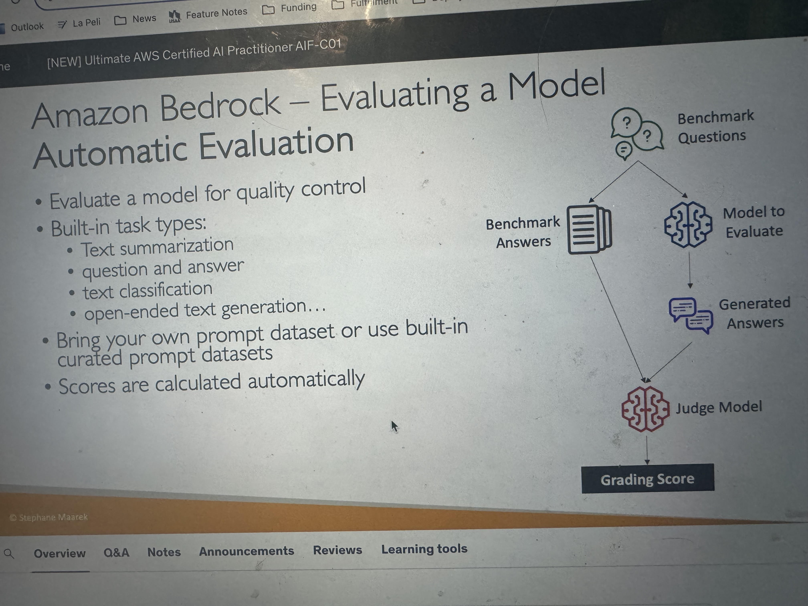

# Amazon Bedrock

## Foundation Models
- You have to set IAM permissions to get access to a foundation model
- "Amazon Nova" is the cheapest foundation model 
- Some models accept attachments, others do not 
### Choosing a Foundation Model
- Diff FMs have different context windows, latencies, etc
- Some models are "multimodal models" meaning types of input and output can vary. Eg a model that can accept both text and image as input 
- Smaller models tend to be more cost-effective, yet know less
### Specific Foundation Models
- Amazon Titan - most high-performing FM from AWS
  - Image, text, multimodal choices via fully-managed APIs (same API as used with Bedrock)
  - Can be customized with your own data 
  - "Titan Text Express" is part of the "Titan Text" family of models, is text-only (not multimodal) and tends to be cheap 
## Custom models - Customization Methods for FMs
### Fine-tuning (Fine-tuning will be a big part of the AIF-C01 exam)
- "Fine-tuning" - provide labeled data in order to train a model to improve performance on specific tasks. Aka adapint a copy of a foundation model with your own data
- Training data must:
  - Be placed in S3
  - Adhere to a specific format
- Fine-tuning will change the weights of the base foundation model
- You MUST use "Provisioned Throughput" to use a fine-tuned model
- Not all models can be fine-tuned!
- Re-training a FM requires a higher budget 
  - Instruction-based fine-tuning is usually cheaper, as computations are less intense, and the amount of data required is usually less
- Requires experienced ML engineers
- You must do the work to prepare the data, do the fine-tuning, evaluate the model
- Running a fine-tuned model is more expensive (since provisioned throughput is required)
#### Use Cases for Fine-Tuning
- A chatbot designed with a particular persona or tone
- A chatbot geared towards a specific purpose (e.g. assisting customers, crafting advertisements)
- Training to use more up-to-date info than what the language model previously accessed
- Training with exclusive data (e.g your historical emails or messages, records from customer service interactions)
- Targeted use cases (categorization, assessing accuracy)
#### Ways to Fine-Tune a Model
##### Instruction-based Fine Tuning
Improves performance of a pre-trained FM on domain-specific tasks, e.g. further trained on a particular field or area of knowledge 

Instruction-based fine-tuning uses **labeled examples** that are **prompt-response pairs**
###### Single-Turn Messaging
A subset of instruction-based fine-tuning in which you provide:
  - System (optional): context for the conversation. eg "You are a helpful assisstant."
  - Messages: An array of message objects, each containing:
    - role: Either user or assistant. eg for role "user" give content "what is AWS" and for role "assistant" give content "it's Amazon Web Services"
    - content: The text content of the message 
##### Continued pre-training
- "Continued pre-training" - Provide unlabeled data to pre-train a foundation model by familiarizing it with certain types of inputs. Also called "domain-adaptation fine-tuning", to make a model an expert in a specific domain 
- Example: Feeding ALL AWS documentation to a model to make it an expert on AWS
### Distillation
- "Distillation" - Generate synthetic data from a large foundation model (teacher) and use the synthetic data to fine-tune a smaller model (student) for your specific use case
#### Hyperparameters (knowing these in detail is beyond the scope of the AIF-C01 cert)
- Hyperparameters allow you to customize training
- "Epochs" - total numver of iterations of all the training data in one cycle for the training model 
- "Learning rate" - the rate at which model parameters are updated after each batch of training data
- "Learning rate warmup steps" - number of iterations over which learning rate is gradually increased to the initial rate specified
### Transfer Learning
"Transfer Learning" - the broad concept (in the ML field) of re-using a pre-trained model to adapt it to a new related task. Widely used for image classification (e.g. beyond teaching how recognize edges, teach it how to recognize images of a certain type) and for NLP (models like BERT and GPT)

Fine-tuning (with Bedrock) IS A SPECIFIC TYPE OF TRANSFER LEARNING! So no that if "Transfer Learning" shows up on an exam about AWS AI services, they are probably referring to fine-tuning with Bedrock 
## Evaluating a Model
### Automatic Evaluation
Bedrock offers "Automatic Evaluation" (allows you to evaluate model for quality control)

Built-in task types:
- Text summarization
- Question and answer
- Text classification
- Open-ended text generation

You must bring your own prompt dataset or use built-in curated prompt datasets

Scores are calculated automatically 

"Benchmark questions" (correspond to "Benchmark answers"):
- Bring your own OR use the ones provided by AWS
- There will be a "Judge Model" which will compare the similarity of generated answers to benchmark answers. That "Judge Model" will give a grading score (there are various ways to calculate the score using statisticial methods, e.g. BERTScore, F1... etc.)
  - 
  - BERTScore: 
    - Semantic similarity between generated text
    - Uses pre-trained BERT models (Bidirectional Encoder Representations from Transformers) to compare the contextualized embeddings of both texts and computes the cosine similarity between them 
  - Perplexity: how well the model predicts the next token (lower is better)

"Benchmark Datasets" - curated collections of data designed specifically for evaluatin the performance of language models (can cover wide range of topics, complexities, linguistic phenomena)
- Helpful to mesaure: accuracy, speed, efficiency, scalability
- Some benchmark datasets allow you to very quickly detect any kind of bias and potential discrimination against a group of people
- You can create your own benchmark dataset that is specific to your business

### Human Evaluation
- Choose a work team to evaluate:
  - Employees of your company
  - Subject-Matter Experts (SMEs)
- Define metrics and how to evaluate, eg: thumbs up/down, ranking, etc.
- Choose from "Built-in task types" (same as Automatic) or add a custom task. Built-in task types for evaluation include:
  - Text classification
    - Compares model outputs against a set of expected classes or labels
    - Example: Sentiment analysis (positive/negative/neutral), topic detection.
  - Text generation - QA (Question Answering)
    - Evaluates how accurately a model answers questions based on a given context or document
    - Example: Given a paragraph, "What is the capital of France?" -> Expected: "Paris"
  - Text generation - Open-ended
    - Evaluates creative or free-form text generation
    - Example: Story generation, email writing, summaries without a strict ground truth. 
    - Evaluated with metrics like relevance, fluency, coherence, etc. 
  - Summarization: 
    - Evaluates the quality of summaries produced by the model compared to human-written summaries
    - Often assessed with metrics like ROUGE, BLEU, or through human preference
      - ROUGE (Recall-Oriented Understudy for Gisting Evaluation):
        - Evaluates automatic summarization and machine translation systems 
        - ROUGE-N - measures the number of matching n-grams between reference and generated text
      - BLEU (Bilingual Evaluation Understudy):
        - Evaluates quality of generated text, especially for transaltions 
        - Considers precision and penalizes too much brevity
        - Looks at a combination of n-grams (1, 2, 3, 4)  
  - Translation:
    - Evaluates the accuracy and fluency of translated texts across languages 
    - Example: English to Spanish translation comparisons
  - Classification (Multilable or Single label)
    - Can handle tasks where more than one label might apply to an input
    - Useful for tagging, content moderation, and metadata classification   

### Business Metrics to Evaluate a Model On
In addition to things such as ROUGE or BERTScore, you can also evaluate a model on business metrics such as:
- User Satisfaction - gather user's feedback to assess satisfaction with model responses
- Average Revenue Per User (ARPU) - average revenuep per user attributed to Gen-AI app
- Cross-Domain Performance - measure the model's ability to perform across different domain tasks
- Conversion rate
- Efficiency - efficiency in computation, resource utilization, etc.

## Pricing
- "Input tokens" & "output tokens" generated affect pricing

## RAG
- [Knowledge Bases](https://aws.amazon.com/bedrock/knowledge-bases/ ) allow RAG with Amazon Bedrock

## Prompt Management
- Bedrock offers [prompt management](https://docs.aws.amazon.com/bedrock/latest/userguide/prompt-management.html) and [prompt templates](https://docs.aws.amazon.com/bedrock/latest/userguide/prompt-management-create.html)
- Bedrock allows you to version prompts
- Bedrock has a [prompt optimization tool](https://www.youtube.com/watch?v=WlD2i6gT9Js)
- Bedrock allows you to create a [prompt flow](https://aws.amazon.com/awstv/watch/f555df58129/ ), sort of like a langchain chain